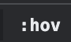

<link href="../base.css" rel="stylesheet" type="text/css" />

← [Tilbake til meny](README.html) [(markdown)](/README.md)

# Inspiser element

Inspiser element lar deg se all html og css kode som nettleseren har mottatt.
Dette er det endelige resultatet av alt utvikleren har prøvd å lage.
For å inspisere en nettside kan du høyre-klikke i nettleseren og velge **Inspect**.
Dette er et veldig kraftig verktøy med masse funksjonalitet. Der er lett å la seg forvirre, men her kommer en kort oppsummering på det som oftest brukes under utvikling.

Eksempel på inspiser element

> # Som regel havner man på fanen `Console`.

 
 

Øverst til venstre i panelet kan man se to knapper.

1. Den til venstre fungerer på samme måte som en color-picker. Klikker du på den kan du deretter klikke på et element i nettsiden. Dette er en snarvei for å finne html og css kode rundt dette området.
2. Den til høyre transformerer vinduet til nettsiden slik at du enkelt kan bytte mellom ulike enheter og skjermstørrelser.

(1) Slik ser det ut hvis du trykker på venstre knapp

(2) Slik ser det ut hvis du trykker på høyre knapp

> # Øverst kan du se at jeg har valgt Iphone XR i portrett-modus.

 

 

## Fanen `Elements`

Fanen `Elements` er der du kan finne all html kode.
Her vil jeg anbefale å bruke piltaster for å navigere seg rundt etter du har plukket deg ut et element.
 
I eksempelet under kan du se at jeg har funnet meg en rad i tabellen. Når den er valgt kan jeg bla rundt i html for å se hvordan den er bygd opp. Samtidig kan man også se all styling på høyre side som tilhører elementet. Legg merke til `.table-row`, der ser vi at alle rader har høyde på 64px og en bestemt bakgrunnsfarge #f4f4f4.

Eksempel fra Feide

Øverst til høyre i fanen `Styles` ser du en knapp kalt `:hov`.

Alle elementer kan ha ulike tilstander. En knapp kan for eksempel være i fokus, trykket ned eller ha en hoverende musepeker over seg. Vi kan skru disse tilstandene av og på i dette panelet for å se hvordan knappen oppfører seg.

`:hov` panel

Eksempel der en rad er i fokus

